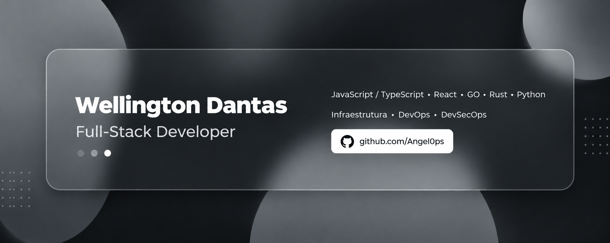

<!-- ========================================================= -->
<!--                  WELLINGTON DANTAS ANGELO                -->
<!--  Paleta: #0a0a0a / #171717 / #2e2e2e / #8a8a8a / #ffffff -->
<!-- ========================================================= -->

<table>
<tr>
<td style="border: 1px solid #ffffff; padding: 0;">

</td>
</tr>
</table>

  

  

---

## `> quem_sou_eu`

<pre>
┌──────────────────────────────────────────────┐
│           WELLINGTON DANTAS ANGELO           │
├──────────────────────────────────────────────┤
│  Eng. de Software — UFCA                     │
│  Full Stack Júnior (Back + Front)            │
│  Diferencial em Cloud, IaC e CI/CD           │
│  Construindo aplicações ponta a ponta        │
└──────────────────────────────────────────────┘
</pre>

 

Sou estudante de **Engenharia de Software** na Universidade Federal do Cariri (UFCA). Minha trajetória técnica começou no suporte nas áreas da administração e Tecnologias da Informação, e hoje avança para **desenvolvimento Full Stack** — atualmente me aprofundo em nuvem através do curso **Cloud Fundamentals, Administration and Solution Architect** pela FIAP.

Direciono minha carreira para o **desenvolvimento Full Stack**, unindo backend, frontend e bancos de dados a uma base em **Cloud, CI/CD e Infrastructure as Code (IaC)** que poucos júniores constroem cedo. Essa combinação é o meu diferencial: penso em como uma aplicação vai rodar, escalar e ser entregue com segurança desde a primeira linha de código. Também automatizo processos com **Python** e **n8n**.

 

<pre>
wellington = {
    "name": "Wellington Dantas Angelo",
    "role": "Full Stack Júnior — Cloud & Infra como diferencial",
    "focus": [
        "Backend (APIs REST)",
        "Frontend (React)",
        "Cloud & IaC",
        "CI/CD"
    ],
    "tools": ["Python", "React", "Docker", "PostgreSQL", "n8n"],
    "university": "UFCA",
    "os": "Arch Linux, by the way"
}
</pre>

---

## `> formação_e_certificações`

**☁️ Cloud Fundamentals, Administration and Solution Architect** — FIAP `em andamento`

Formação técnica complementar

 
Assistente de Tecnologias da Informação • Assistente Administrativo Completo • Profissional em Montagem e Reparo de Computadores • Profissional em Comércio de Bens, Serviços e Turismo e muito mais.

---

## `> foco`

| Área | Destaque |
|---|---|
| **Backend** | APIs REST, autenticação, lógica de negócio |
| **Frontend** | Interfaces em React consumindo APIs |
| **Cloud & IaC** | AWS, Azure e provisionamento versionado |
| **CI/CD** | Pipelines, testes e entregas automatizadas |
| **Databases** | Modelagem relacional e SQL |
| **DevSecOps** | Segurança e compliance no ciclo de dev |

---

## `> minha stack em aprendizado`

**Linguagens**

**Frontend**

**Infraestrutura & Orquestração**

**Ambientes**

**Bancos de Dados**

**Ferramentas**

---

## `> frameworks_e_práticas`

---

## `> estudando_atualmente`

---

## `> projetos`

### [`Jogo de Corrida Arcade`](https://github.com/Gabrielsampp/Jogo-de-Corrida-arcade)

> Projeto final da disciplina de Introdução à Programação (2026.1): corrida arcade em Pygame, com pistas customizáveis, ranking global e painel administrativo via terminal. Projeto em equipe (6 pessoas) — minha parte cobriu o módulo de Pista, o sistema do jogador e o README do repositório.

**Conceitos praticados:** Arquitetura modular • Colaboração em equipe com Git • Persistência de dados em JSON • Documentação técnica

> 🚧 Próximo projeto (em construção): uma aplicação full stack própria — API + banco de dados + front-end em React, containerizada e com deploy via CI/CD. É o projeto que vai provar a combinação Full Stack + Infra na prática.

---

