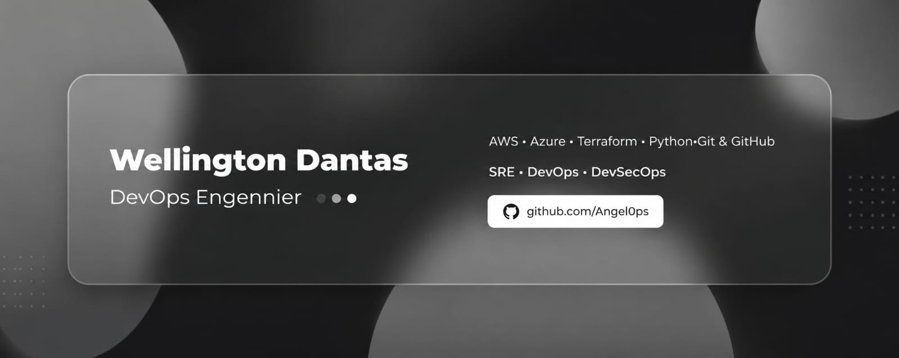

---

- 🔭 I’m a Student Software Engineer from Federal University of Cariri.
- 💬 Let's talk about Language Technologies, Cloud Orchestration, DevOps, security etc.
- 🐧 I use Linux, btw 😉
- 📫 **How to reach me**: [LinkedIn](https://www.linkedin.com/in/wellingtondantasangelo/)

---

### About Me  

I'm a Software Engineering student at the Federal University of Cariri (UFCA) and a certified professional in Information Management and Information Technology.

Currently, I am directing my career toward the DevOps field, focusing on building scalable, automated, secure, and reliable environments and solutions.

To achieve this, I continuously deepen my knowledge of CI/CD, Infrastructure as Code (IaC), Cloud Computing, Operating Systems, Compliance, process automation with Python and n8n, as well as the application of security practices throughout the software development lifecycle.

---

### Languages and Tools:

### Database Systems:

### Frameworks:

---

 

 

