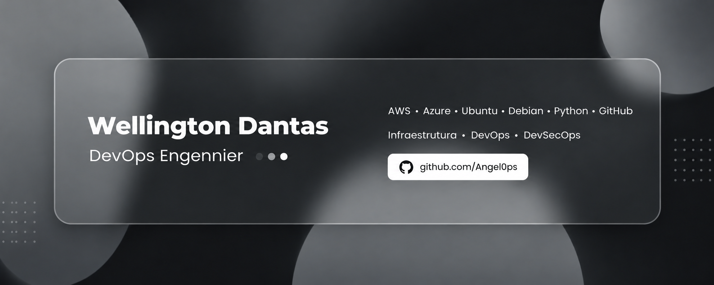

<!-- ========================================================= -->
<!--                  WELLINGTON DANTAS ANGELO                -->
<!--  Paleta: #0a0a0a / #171717 / #2e2e2e / #8a8a8a / #ffffff -->
<!-- ========================================================= -->

<table>
<tr>
<td style="border: 1px solid #ffffff; padding: 0;">

</td>
</tr>
</table>

  

  

---

## `> quem_sou_eu`

<pre>
┌──────────────────────────────────────────────┐
│           WELLINGTON DANTAS ANGELO           │
├──────────────────────────────────────────────┤
│  Eng. de Software — UFCA                     │
│  Foco em DevOps e Infraestrutura             │
│  CI/CD, IaC e automação de processos         │
│  Segurança, compliance e confiabilidade      │
└──────────────────────────────────────────────┘
</pre>

 

Sou estudante de **Engenharia de Software** na Universidade Federal do Cariri (UFCA). Minha trajetória técnica começou no suporte nas áreas da administração e Tecnologias da Informação, e hoje avança para **Cloud e DevOps** — atualmente me especializo através do curso **Cloud Fundamentals, Administration and Solution Architect** pela FIAP.

Direciono minha carreira para **DevOps**, com foco na construção de ambientes e soluções escaláveis, automatizadas, seguras e confiáveis. Para isso, venho aprofundando meus conhecimentos em **CI/CD, Infrastructure as Code (IaC), Cloud Computing, Sistemas Operacionais e Compliance**, além de automação de processos com **Python** e **n8n** e da aplicação de práticas de segurança no desenvolvimento.

Vamos conversar sobre infraestrutura, orquestração em nuvem, DevOps e cibersegurança.

 

<pre>
wellington = {
    "name": "Wellington Dantas Angelo",
    "role": "DevOps Engineer in progress",
    "focus": [
        "CI/CD",
        "Infrastructure as Code",
        "Cloud Computing",
        "DevSecOps"
    ],
    "tools": ["Docker", "Kubernetes", "Jenkins", "Python", "n8n"],
    "university": "UFCA",
    "os": "Linux, by the way"
}
</pre>

---

## `> formação_e_certificações`

**☁️ Cloud Fundamentals, Administration and Solution Architect** — FIAP `em andamento`

Formação técnica complementar

 
Assistente de Tecnologias da Informação • Assistente Administrativo Completo • Montagem e Reparo de Computadores • Profissional em Comércio de Bens, Serviços e Turismo.

---

## `> foco`

| Área | Destaque |
|---|---|
| **CI/CD** | Pipelines, builds e entregas contínuas |
| **IaC** | Provisionamento versionado e reprodutível |
| **Cloud** | AWS, Azure e arquiteturas escaláveis |
| **Linux** | Administração, shell e troubleshooting |
| **Automação** | Python, n8n e rotinas operacionais |
| **DevSecOps** | Compliance e segurança no ciclo de dev |

---

## `> minha stack em aprendizado`

**Linguagens**

**Infraestrutura & Orquestração**

**Ambientes**

**Bancos de Dados**

**Ferramentas**

---

## `> frameworks_e_práticas`

---

## `> estudando_atualmente`

---

## `> projetos`

### [`Jogo de Corrida Arcade`](https://github.com/Gabrielsampp/Jogo-de-Corrida-arcade)

> Projeto final da disciplina de Introdução à Programação (2026.1): corrida arcade em Pygame, com pistas customizáveis, ranking global e painel administrativo via terminal. Projeto em equipe (6 pessoas) — minha parte cobriu o módulo de Pista, o sistema do jogador e o README do repositório.

**Conceitos praticados:** Arquitetura modular • Colaboração em equipe com Git • Persistência de dados em JSON • Documentação técnica

---

